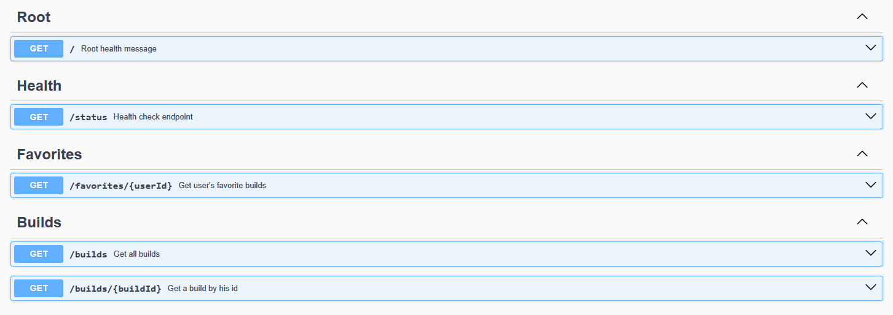
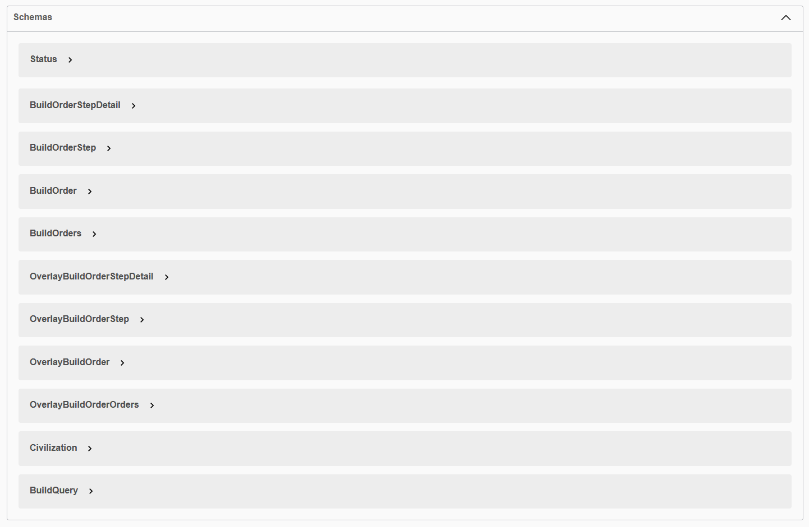

# aoe4-guides-api

This service provides a public REST api to access Age of Empires 4 build orders from aoe4guides.com

## Supported Civilizations

The API supports all Age of Empires IV civilizations including:

- **Base Game**: English (ENG), French (FRE), Rus (RUS), Malians (MAL), Delhi Sultanate (DEL), Holy Roman Empire (HRE), Abbasid Dynasty (ABB), Ottomans (OTT), Chinese (CHI), Mongols (MON)
- **The Sultans Ascend DLC**: Byzantines (BYZ), Japanese (JAP), Ayyubids (AYY), Jeanne d'Arc (JDA), Zhu Xi's Legacy (ZXL), Order of the Dragon (DRA)
- **The Knights of the Cross and Crescent DLC**: House of Lancaster (HOL), Knights Templar (KTE)
- **The Dynasties of the East DLC**: Golden Horde (GOH), Sengoku Daimyo (SEN), Macedonian Dynasty (MAC), Tughlaq Dynasty (TUG), Jin Dynasty (JIN)

## API Documentation

<https://aoe4guides.com/api/api-docs/>

### Quick Start

The base URL is the service's own host. `aoe4guides.com/api` is **not** a public
base: the site proxies a single route there for its own use, and everything else
under that path answers `404`.

```bash
BASE=https://aoe4-guides-api-7h2vti5ckq-ey.a.run.app

# Get latest 10 builds
GET $BASE/builds

# Get builds for a specific civilization (e.g., English)
GET $BASE/builds?civ=ENG

# Get builds by author
GET $BASE/builds?author=USER_ID

# Get a specific build
GET $BASE/builds/BUILD_ID

# Get overlay format for build order tools
GET $BASE/builds/BUILD_ID?overlay=true
```



All schemas are available for both normal and overlay build orders.



## Fair use

The API stays open and unauthenticated, and it should be usable without asking
anyone. Two guards keep that sustainable:

- **Caching.** Responses carry `Cache-Control` and are served from a short
  in-process cache: 60s for list endpoints, 5min for `/builds/{buildId}`. Please
  respect it rather than re-fetching the same build on every page view of your
  own site.
- **Rate limits per IP.** 30/min and 300/hour for list endpoints, 120/min and
  1200/hour for `/builds/{buildId}`. Over the limit the API answers `429`; the
  `RateLimit` response headers show the remaining budget for each policy before
  you get there.

The limits sit an order of magnitude above what real integrations use - the
busiest legitimate consumer in a measured month stayed under 20 requests per
hour. If yours genuinely needs more, open an issue rather than working around
them.

If you build on this data, credit aoe4guides.com and link back. The build orders
are written by its community.


## Recommended IDE Setup

[VSCode](https://code.visualstudio.com/)

## Features

- ✅ REST API endpoints for build orders
- ✅ Support for all AoE4 civilizations (24 total)
- ✅ Filtering by civilization and author
- ✅ Sorting by score, creation time, views, likes
- ✅ Overlay format support for build order tools
- ✅ User favorites system
- ✅ Swagger/OpenAPI documentation
- ✅ CORS enabled for web applications

## Project Setup

```sh
npm install
```

### Start server for development

```sh
npm build && npm start
```

The server will start on port 8080 by default, or use the PORT environment variable.

## Docker

### Build the Docker image

```sh
docker build -t aoe4guides-api .
```

### Run the Docker container

```sh
docker run -p 8080:8080 aoe4guides-api
```

## License

The project is licensed under MIT.

## Disclaimer

Age of Empires IV © Microsoft Corporation.

This project was created under Microsoft's ["Game Content Usage Rules"](https://www.xbox.com/en-US/developers/rules) using assets from Age of Empires IV, and it is not endorsed by or affiliated with Microsoft.
